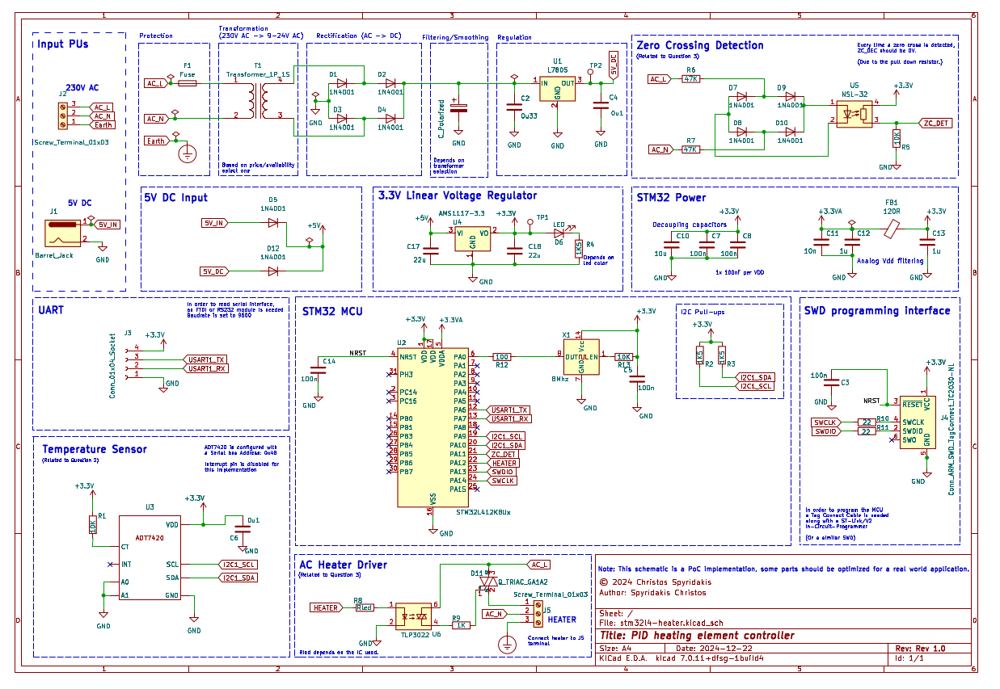

# stm32l4-heater

## Purpose
This is a Proof-of-Concept (PoC) application of a Heating Element System that is controlled in a closed loop, using a PID controller. To determine the heating element control signal, we first read the current temperature and based on the error, the generation of the signal occurs.

In order to control the component, a zero crossing approach is used to set the durations open of a TRIAC.

## Design
For the purposes of this project, a Linear Power Supply (LPS) is used instead of a Switch-Mode Power Supply (SMPS), due to the ease of design for the PoC circuit, despite being less efficient.

In a real-world application, considering the fact that an STM32L4 is occasionally used in low-power applications, most probably a SMPS should be considered to power the PCB, since the power would likely be one requirement that needs to be concerned about.

## Schematic

The schematic was designed using [Kicad](https://kicad.org/) and the related files are also availabe [here](./pcb/stm32l4-heater/). Inside the [doc/](./doc/) dir, a PDF file of the schematic can be found too.

## Code
The code is available on this [directory](./code/stm32l4-heater/) and it contains a STM32CUBEIDE project.

## MCU - STM32L4 
The MCU that was selected is the STM32L412K8U6, with the following specifications:
* Distributor: Mouser.com
  *  URL: https://gr.mouser.com/ProductDetail/STMicroelectronics/STM32L412K8U6?qs=l7cgNqFNU1iqBWKB4DHwcA%3D%3D
  *  Price (24/12/2024): 
       | Qty. |   Unit Price    |
       | ---- | --------------- |
       |  1   |        2.4€     |
       |  10  |        1.52€    |
  * Stock (24/12/2024): 3774
* Package/Case: QFN-32 

The reasons for this selection are as follows:
  * First and foremost, it has all the necessary hardware for our application (not many requirements to fill in this very case).
  * A common package makes it easy to select another MCU in case this one is out of stock in the future, and it is also easy to solder, even with a heat gun.
  * An affordable price, less than 2€ per unit.
  * Sufficient stock at the moment of speaking.

## Notice
This is a PoC implementation, in a real applications various parts of the hardware/software should be altered to include a better solution.

## License
Everything that is related to hardware in this repository is licensed under the CERN-OHL-S-2.0 with the added condition that it may not be used for commercial purposes without prior permission from the license holder.

One the other hand, the code is licensed under the MIT license. 
